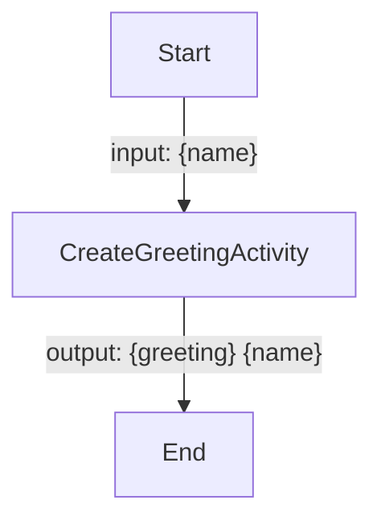
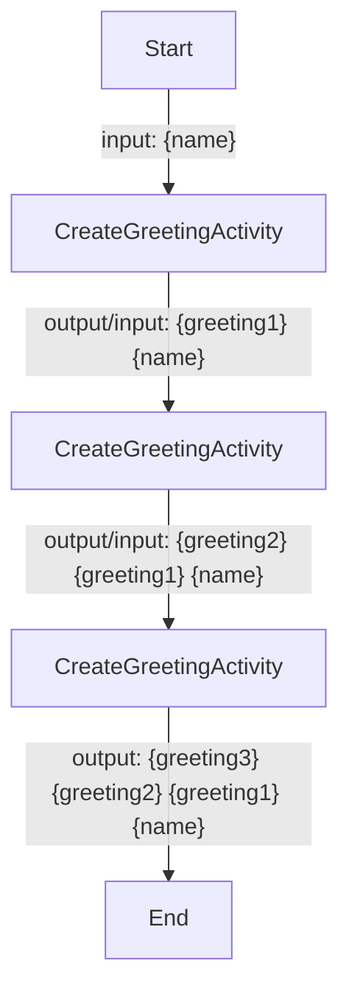
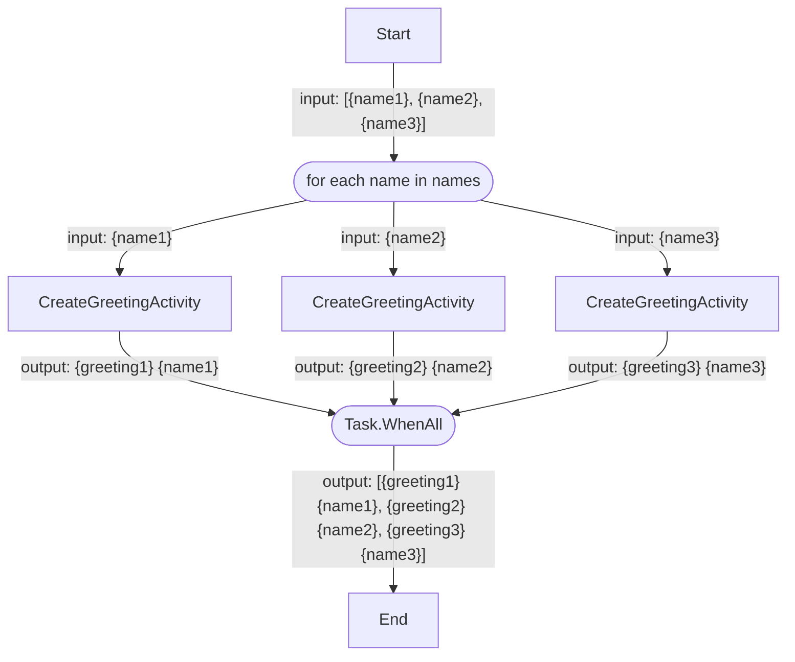
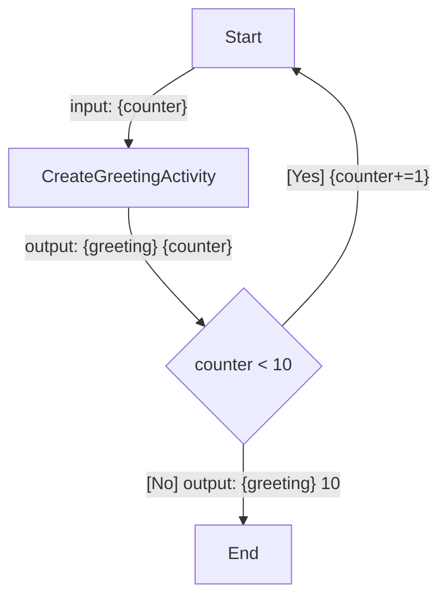
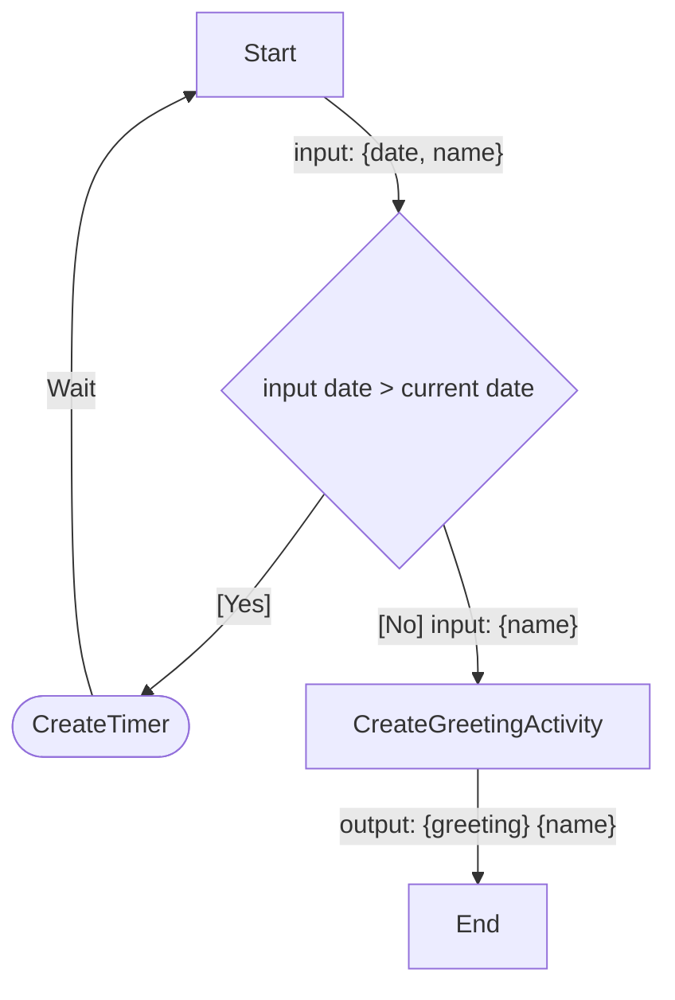
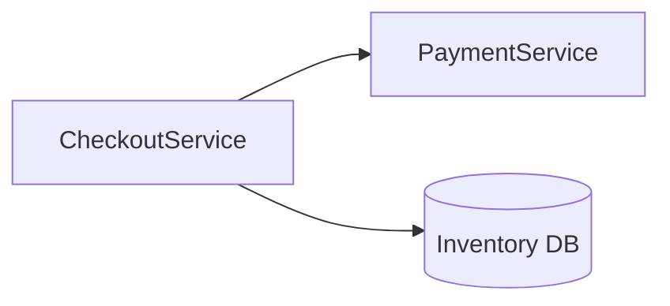
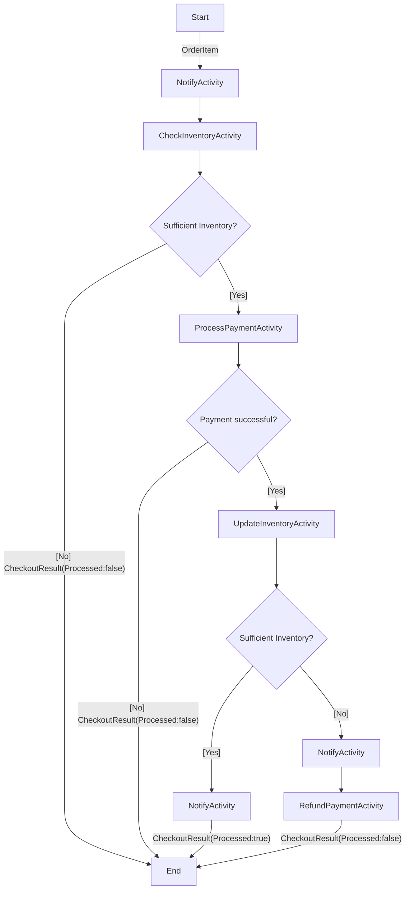

# Dapr workflow demos

Demos applications that use the Dapr Workflow building block. 

**Read the blog post: [Understanding the Dapr Workflow engine & authoring workflows in .NET](https://www.diagrid.io/blog/authoring-dapr-workflows-in-dotnet)**

## Prerequisites

1. [.NET 7 SDK](https://dotnet.microsoft.com/download/dotnet/7.0)
2. [Dapr CLI](https://docs.dapr.io/getting-started/install-dapr-cli/)
   - Ensure that you're using **v1.11** of the Dapr runtime and the CLI, since there have been [breaking changes](https://github.com/dapr/dapr/pull/6218) to the Workflow API from v1.10 to v1.11.
3. A REST client, such as [cURL](https://curl.se/), or the VSCode [REST client extension](https://marketplace.visualstudio.com/items?itemName=humao.rest-client).

    > The VSCode REST client is configured as a recommended extension when opening this repo in VSCode.

## Hello world workflow sample

The Hello World Workflow sample is a very basic workflow with just one activity that returns a random greeting. The workflow takes a name as input and returns a greeting with the name as output.



### Run the HelloWorldWorkflowSample app

1. Change to the BasicWorkflowSamples directory and build the ASP.NET app:

    ```bash
    cd BasicWorkflowSamples
    dotnet build
    ```

2. Run the app using the Dapr CLI:

    ```bash
    dapr run --app-id basic-workflows --app-port 5065 --dapr-http-port 3500 --resources-path ./ResourcesLocal dotnet run
    ```

    > Ensure the --app-port is the same as the port specified in the launchSettings.json file.

3. Start the `HelloWorldWorkflow` via the Workflow HTTP API using cURL, or use the [basicworkflows.http](BasicWorkflowSamples/basicworkflows.http) file if you're using VSCode with the REST client:

   ```bash
   curl -i -X POST http://localhost:3500/v1.0-alpha1/workflows/dapr/HelloWorldWorkflow/start?instanceID=1234a \
     -H "Content-Type: application/text/plain" \
     -d '"World"'
    ```

    > Note that `1234a` in the URL is the workflow instance ID. This can be any string you want.

    Expected result:

    ```json
    {
        "instanceID": "<WORKFLOW_ID>"
    }
    ```

4. Check the workflow status via Workflow HTTP API:

    ```bash
    curl -i -X GET http://localhost:3500/v1.0-alpha1/workflows/dapr/1234a
    ```

    Expected result:

    ```json
    {
    "instanceID": "<WORKFLOW_ID>",
    "workflowName": "HelloWorldWorkflow",
    "createdAt": "2023-06-19T13:19:18.316956600Z",
    "lastUpdatedAt": "2023-06-19T13:19:18.333226200Z",
    "runtimeStatus": "COMPLETED",
    "properties": {
        "dapr.workflow.custom_status": "",
        "dapr.workflow.input": "\"World\"",
        "dapr.workflow.output": "\"Ciao World\""
    }
}
    ```

## Chaining workflow sample

The Chaining Workflow sample is a workflow that chains three activities of the same type `CreateGreetingActivity`, each prepending a random greeting to the input. The output of the activity is used as an input for the next activity in the chain.



1. Ensure that the BasicWorkflowSamples app is still running, if not change to the BasicWorkflowSamples directory, build the app, and run the app using the Dapr CLI:

    ```bash
    cd BasicWorkflowSamples
    dotnet build
    dapr run --app-id basic-workflows --app-port 5065 --dapr-http-port 3500 --resources-path ./ResourcesLocal dotnet run
    ```

2. Start the `ChainingWorkflow` via the Workflow HTTP API using cURL, or use the [basicworkflows.http](BasicWorkflowSamples/basicworkflows.http) file if you're using VSCode with the REST client:

   ```bash
   curl -i -X POST http://localhost:3500/v1.0-alpha1/workflows/dapr/ChainingWorkflow/start?instanceID=1234b \
     -H "Content-Type: application/text/plain" \
     -d '"Marc"'
    ```

    > Note that `1234b` in the URL is the workflow instance ID. This can be any string you want.

    Expected result:

    ```json
    {
        "instanceID": "<WORKFLOW_ID>"
    }
    ```

3. Check the workflow status via Workflow HTTP API:

    ```bash
    curl -i -X GET http://localhost:3500/v1.0-alpha1/workflows/dapr/1234b
    ```

    Expected result:

    ```json
    {
    "instanceID": "<WORKFLOW_ID>",
    "workflowName": "ChainingWorkflow",
    "createdAt": "2023-06-19T13:21:08.611149200Z",
    "lastUpdatedAt": "2023-06-19T13:21:08.647482Z",
    "runtimeStatus": "COMPLETED",
    "properties": {
        "dapr.workflow.custom_status": "",
        "dapr.workflow.input": "\"World\"",
        "dapr.workflow.output": "\"Hello Hi Konnichiwa World\""
        }
    }
    ```

## Fan-out / Fan-in workflow sample

The Fan-out / Fan-in Workflow sample is a workflow that fans out and schedules an activity (`CreateGreetingActivity`) for each element in the input array and waits until all of the activities are completed. The output of the workflow is an array of greetings.



1. Ensure that the BasicWorkflowSamples app is still running, if not change to the BasicWorkflowSamples directory, build the app, and run the app using the Dapr CLI:

    ```bash
    cd BasicWorkflowSamples
    dotnet build
    dapr run --app-id basic-workflows --app-port 5065 --dapr-http-port 3500 --resources-path ./ResourcesLocal dotnet run
    ```

2. Start the `FanOutFanInWorkflow` via the Workflow HTTP API using cURL, or use the [basicworkflows.http](BasicWorkflowSamples/basicworkflows.http) file if you're using VSCode with the REST client:

   ```bash
   curl -i -X POST http://localhost:3500/v1.0-alpha1/workflows/dapr/FanOutFanInWorkflow/start?instanceID=1234c \
     -H "Content-Type: application/json" \
     -d '["Amsterdam", "Chicago", "New York"]'
    ```

    > Note that `1234c` in the URL is the workflow instance ID. This can be any string you want.

    Expected result:

    ```json
    {
        "instanceID": "<WORKFLOW_ID>"
    }
    ```

3. Check the workflow status via Workflow HTTP API:

    ```bash
    curl -i -X GET http://localhost:3500/v1.0-alpha1/workflows/dapr/1234c
    ```

    Expected result:

    ```json
    {
    "instanceID": "<WORKFLOW_ID>",
    "workflowName": "FanOutFanInWorkflow",
    "createdAt": "2023-06-19T13:22:42.056622400Z",
    "lastUpdatedAt": "2023-06-19T13:22:42.093666600Z",
    "runtimeStatus": "COMPLETED",
    "properties": {
        "dapr.workflow.custom_status": "",
        "dapr.workflow.input": "[\"Amsterdam\",\"Chicago\",\"New York\"]",
        "dapr.workflow.output": "[\"Hi Amsterdam\",\"Hola Chicago\",\"Guten Tag New York\"]"
        }
    }
    ```

## Monitor sample

The Monitor sample is a workflow with a numeric input (counter) and restarts the workflow (with an updated counter) until the counter reaches 10. The workflow diagram is as follows:



1. Ensure that the BasicWorkflowSamples app is still running, if not change to the BasicWorkflowSamples directory, build the app, and run the app using the Dapr CLI:

    ```bash
    cd BasicWorkflowSamples
    dotnet build
    dapr run --app-id basic-workflows --app-port 5065 --dapr-http-port 3500 --resources-path ./ResourcesLocal dotnet run
    ```

2. Start the `MonitorWorkflow` via the Workflow HTTP API using cURL, or use the [basicworkflows.http](BasicWorkflowSamples/basicworkflows.http) file if you're using VSCode with the REST client:

   ```bash
   curl -i -X POST http://localhost:3500/v1.0-alpha1/workflows/dapr/MonitorWorkflow/start?instanceID=1234d \
     -H "Content-Type: application/text/plain" \
     -d '0'
    ```

    > Note that `1234d` in the URL is the workflow instance ID. This can be any string you want.

    Expected result:

    ```json
    {
        "instanceID": "<WORKFLOW_ID>"
    }
    ```

3. Check the workflow status via Workflow HTTP API:

    ```bash
    curl -i -X GET http://localhost:3500/v1.0-alpha1/workflows/dapr/1234d
    ```

    Expected result:

    ```json
{
  "instanceID": "<WORKFLOW_ID>",
  "workflowName": "MonitorWorkflow",
  "createdAt": "2023-06-19T13:24:23.004744700Z",
  "lastUpdatedAt": "2023-06-19T13:24:23.016307900Z",
  "runtimeStatus": "COMPLETED",
  "properties": {
    "dapr.workflow.custom_status": "",
    "dapr.workflow.input": "10",
    "dapr.workflow.output": "\"Hey 10\""
  }
}
    ```

## Timer sample

The Timer sample is a workflow with a TimerWorkflowInput object that contains a name and a date. If the date from the input is larger that the current date, a timer is started and the workflow will only continue once the timer has completed.:



1. Ensure that the BasicWorkflowSamples app is still running, if not change to the BasicWorkflowSamples directory, build the app, and run the app using the Dapr CLI:

    ```bash
    cd BasicWorkflowSamples
    dotnet build
    dapr run --app-id basic-workflows --app-port 5065 --dapr-http-port 3500 --resources-path ./Resources dotnet run
    ```

2. Start the `TimerWorkflow` via the Workflow HTTP API using cURL, or use the [basicworkflows.http](BasicWorkflowSamples/basicworkflows.http) file if you're using VSCode with the REST client:

   ```bash
   curl -i -X POST http://localhost:3500/v1.0-alpha1/workflows/dapr/TimerWorkflow/start?instanceID=1234e \
     -H "Content-Type: application/text/plain" \
     -d '"Marc"'
    ```

    > Note that `1234e` in the URL is the workflow instance ID. This can be any string you want.

    Expected result:

    ```json
    {
        "instanceID": "<WORKFLOW_ID>"
    }
    ```

3. Check the workflow status via Workflow HTTP API:

    ```bash
    curl -i -X GET http://localhost:3500/v1.0-alpha1/workflows/dapr/1234e
    ```

    Expected result:

    ```json
    {
    "instanceID": "<WORKFLOW_ID>",
    "workflowName": "TimerWorkflow",
    "createdAt": "2023-06-19T13:25:59.745344700Z",
    "lastUpdatedAt": "2023-06-19T13:25:59.768925500Z",
    "runtimeStatus": "COMPLETED",
    "properties": {
        "dapr.workflow.custom_status": "",
        "dapr.workflow.input": "{\"DateTime\": \"2023-05-29T13:44:00+00:00\", \"Name\": \"World\"}",
        "dapr.workflow.output": "\"Guten Tag World at 2023-05-29 15:44:00\""
    }
    }
    ```

## CheckoutService sample



The CheckoutService app contains workflow that processes an order. The workflow takes an `OrderItem` as input and returns a `CheckoutResult` as output. The `CheckoutWorkflow` workflow uses these activities:

- `NotifyActivity`: Notifies the customer of the progress of the order.
- `CheckInventoryActivity`: Checks if the inventory is sufficient.
- `ProcessPaymentActivity`: Processes the payment, by calling another Dapr service (PaymentService).
- `UpdateInventoryActivity`: Updates the inventory after checking it again.
- `RefundPaymentActivity`: Refunds the payment if the `UpdateInventoryActivity` throws an exception.



The `CheckInventoryActivity` and `UpdateInventoryActivity` classes use [Dapr's state management building block](https://docs.dapr.io/developing-applications/building-blocks/state-management/) to manage the inventory in a Redis state store.

The `ProcessPaymentActivity` and `RefundPaymentActivity` call out to the PaymentService.

Next to the workflow, this application has an `InventoryController` with the following endpoints:

- `GET http://localhost:5064/inventory`: retrieves the inventory
- `DELETE http://localhost:5064/inventory`: clears the inventory
- `POST http://localhost:5064/inventory/restock`: restocks the inventory

The `InventoryController` also uses Dapr's state management building block.

### Run the PaymentService app

The CheckoutService app relies on the PaymentService app to process the payment. The PaymentService app is a small ASP.NET app that exposes two endpoints:

- `/pay`: processes the payment
- `/refund`: refunds the payment

The PaymentService app uses the Dapr Configuration API to read the `isPaymentSuccess` configuration item from the configuration store (Redis). If the item key is not present, or if the item value is set to the string "true", the payment will be successful. If the item value is set to the string "false", the payment will fail. Use this setting to simulate a failed payment and check the workflow result.

Setting the configuration item is done via the redis-cli in the dapr_redis docker container:

```bash
docker exec dapr_redis redis-cli MSET isPaymentSuccess "true"
```

To configure the PaymentService to return a failed payment response use:

```bash
docker exec dapr_redis redis-cli MSET isPaymentSuccess "false"
```

Set the `isPaymentSuccess` config item to "true" and start the PaymentService as follows:

1. Open a new terminal, change to the PaymentService directory and build the ASP.NET app:

    ```bash
    cd PaymentService
    dotnet build
    ```

2. Run the app using the Dapr CLI:

    ```bash
    dapr run --app-id payment --app-port 5063 --dapr-http-port 3501 --resources-path ./Resources dotnet run
    ```

### Run the CheckoutService app

1. Open a new terminal, change to the CheckoutService directory and build the ASP.NET app:

    ```bash
    cd CheckoutService
    dotnet build
    ```

2. Run the app using the Dapr CLI:

    ```bash
    dapr run --app-id checkout --app-port 5064 --dapr-http-port 3500 --resources-path ./Resources dotnet run
    ```

    > Ensure the --app-port is the same as the port specified in the launchSettings.json file.

3. Check the inventory using cURL, or use the [checkout.http](CheckoutService/checkout.http) file if you're using VSCode with the REST client:

    ```bash
    curl -X POST http://localhost:5064/inventory/restock
    ```

    If the quantity of the items is not 0, clear the inventory by running:

    ```bash
    curl -X POST http://localhost:5064/inventory/clear
    ```

4. Try ordering 100 paperclips while the inventory is not sufficient. Start the `CheckoutWorkflow` via the Workflow HTTP API:

   ```bash
   curl -i -X POST http://localhost:3500/v1.0-alpha1/workflows/dapr/CheckoutWorkflow/start?instanceID=1234f \
     -H "Content-Type: application/json" \
     -d '{"Name": "Paperclips", "Quantity": 100}'
    ```

    > Note that `1234f` in the URL is the workflow instance ID. This can be any string you want.

    Expected result:

    ```json
    {
        "instanceID": "<WORKFLOW_ID>"
    }
    ```

    > Pay attention to the console output. A message will appear that indicates the inventory is insufficient.

5. Check the workflow status via Workflow HTTP API:

    ```bash
    curl -i -X GET http://localhost:3500/v1.0-alpha1/workflows/dapr/1234f
    ```

    Expected result:

    ```json
    {
    "instanceID": "<WORKFLOW_ID>",
    "workflowName": "CheckoutWorkflow",
    "createdAt": "2023-06-19T13:37:30.261385700Z",
    "lastUpdatedAt": "2023-06-19T13:37:30.303315100Z",
    "runtimeStatus": "COMPLETED",
    "properties": {
        "dapr.workflow.custom_status": "\"Stopped order process due to insufficient inventory.\"",
        "dapr.workflow.input": "{\"Name\": \"Paperclips\", \"Quantity\": 125}",
        "dapr.workflow.output": "{\"Processed\":false}"
        }
    }
    ```

    > Depending on how quick the status is retrieved after starting the workflow, the `dapr.workflow.runtime_status` could still be `"RUNNING"`. Repeat the GET status request until the status is `"COMPLETED"`.

6. Restock the inventory:

    ```bash
    curl -X POST http://localhost:5064/inventory/restock
    ```

    Expected result: `HTTP 200 OK`

7. Try ordering paperclips again, now within the limits of the inventory. Start the `CheckoutWorkflow` via the Workflow HTTP API:

    ```bash
    curl -i -X POST http://localhost:3500/v1.0-alpha1/workflows/dapr/CheckoutWorkflow/start?instanceID=1234g \
     -H "Content-Type: application/json" \
     -d '{"Name": "Paperclips", "Quantity": 25}'
    ```

    > Note that `1234g` in the URL is the workflow instance ID. This can be any string you want.

    Expected result:

    ```json
    {
        "instanceID": "<WORKFLOW_ID>"
    }
    ```

    > Pay attention to the console output. Messages will appear that indicate the inventory is sufficient and payment has been processed successfully.

8. Check the workflow status via Workflow HTTP API:

    ```bash
    curl -i -X GET http://localhost:3500/v1.0-alpha1/workflows/dapr/1234g
    ```

    Expected result:

    ```json
    {
    "instanceID": "<WORKFLOW_ID>",
    "workflowName": "CheckoutWorkflow",
    "createdAt": "2023-06-19T13:35:42.126109Z",
    "lastUpdatedAt": "2023-06-19T13:35:53.644632200Z",
    "runtimeStatus": "COMPLETED",
    "properties": {
        "dapr.workflow.custom_status": "",
        "dapr.workflow.input": "{\"Name\": \"Paperclips\",\"Quantity\": 25}",
        "dapr.workflow.output": "{\"Processed\":true}"
        }
    }
    ```

9. Inspect the logs in ZipKin: [`localhost:9411/zipkin`](http://localhost:9411/zipkin). Find the entry marked `checkout:create_orchestration||checkoutworkflow` and show the details. You'll now see a timeline of the workflow at the top, and the activities underneath.

    

### Unhappy paths

Now try these different scenarios and check the workflow result.

Start the CheckoutWorkflow with:

1. Shutting down the CheckoutService app once the CheckoutWorkflow has started. Restart the CheckoutService and watch the logs.
2. A failing payment (set the `isPaymentSuccess` configuration item to "false").
3. Shut down the PaymentService completely (check the logs for the retry attempts).

## Resources

1. [Dapr Workflow overview](https://docs.dapr.io/developing-applications/building-blocks/workflow/workflow-overview/).
2. [How to: Author and manage Dapr Workflow in the .NET SDK](https://docs.dapr.io/developing-applications/sdks/dotnet/dotnet-workflow/dotnet-workflow-howto/)

## More information

Any questions or comments about this sample? Join the [Dapr discord](https://bit.ly/dapr-discord) and post a message the `#workflow` channel.
Have you made something with Dapr? Post a message in the `#show-and-tell` channel, we love to see your creations!
