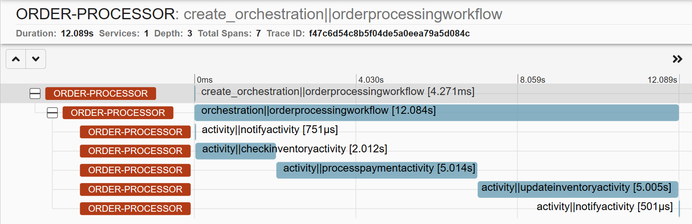

# Dapr Workflow Retail Demo

Demo of the Dapr Workflow building block in a retail context.

## Prerequisites

1. [.NET 7 SDK](https://dotnet.microsoft.com/download/dotnet/7.0)
2. [Dapr CLI](https://docs.dapr.io/getting-started/install-dapr-cli/)

## Run the Workflow App

1. Change to the Retail directory and build the ASP.NET app:

    ```bash
    cd Retail
    dotnet build
    ```

2. Run the app using the Dapr CLI:

    ```bash
    dapr run --app-id order-processor --app-port 5064 --dapr-http-port 3500 --resources-path ./Resources dotnet run
    ```

    > Ensure the --app-port is the same as the port specified in the launchSettings.json file.

3. Check the inventory using cURL or use the [local.http](Retail/local.http) file if you're using VSCode with the REST client):

    ```bash
    curl -X POST http://localhost:5064/stock/restock
    ```

    If the quantity of the items is not 0, clear the inventory by running:

    ```bash
    curl -X POST http://localhost:5064/stock/clear`.
    ```

4. Try ordering 100 paperclips while the inventory is not sufficient. Start the `OrderProcessingWorkflow` via the Workflow HTTP API:

   ```bash
   curl -i -X POST http://localhost:3500/v1.0-alpha1/workflows/dapr/OrderProcessingWorkflow/1234a/start \
     -H "Content-Type: application/json" \
     -d '{ "input" : {"Name": "Paperclips", "Quantity": 100}}'
    ```

    > Note that `1234a` in the URL is the workflow instance ID. This can be any string you want.

    Expected result:

    ```json
    {
        "instance_id": "<WORKFLOW_ID>"
    }
    ```

5. Check the workflow status via Workflow HTTP API:

    ```bash
    curl -i -X GET http://localhost:3500/v1.0-alpha1/workflows/dapr/OrderProcessingWorkflow/1234a/status
    ```

    Expected result:

    ```json
    {
        "WFInfo": {
            "instance_id": "<WORKFLOW_ID>"
        },
        "start_time": "2023-05-01T12:15:45Z",
        "metadata": {
            "dapr.workflow.custom_status": "\"Stopped order process due to insufficient inventory.\"",
            "dapr.workflow.input": "{\"Name\":\"Paperclips\",\"Quantity\":100}",
            "dapr.workflow.last_updated": "2023-05-01T12:15:45Z",
            "dapr.workflow.name": "OrderProcessingWorkflow",
            "dapr.workflow.output": "{\"Processed\":false}",
            "dapr.workflow.runtime_status": "COMPLETED"
        }
    }

    > Depending on how quick the status is retrieved after starting the workflow, the `dapr.workflow.runtime_status` could still be `"RUNNING"`. Repeat the GET status request until the status is `"COMPLETED"`.

6. Restock the inventory:

    ```bash
    curl -X POST http://localhost:5064/stock/restock
    ```

    Expected result: `HTTP 200 OK`

7. Try ordering paperclips again, now within the limits of the inventory. Start the `OrderProcessingWorkflow` via the Workflow HTTP API:

    ```bash
    curl -i -X POST http://localhost:3500/v1.0-alpha1/workflows/dapr/OrderProcessingWorkflow/1234b/start \
     -H "Content-Type: application/json" \
     -d '{ "input" : {"Name": "Paperclips", "Quantity": 100}}'
    ```

    > Note that `1234b` in the URL is the workflow instance ID. This can be any string you want.

8. Check the workflow status via Workflow HTTP API:

    ```bash
    curl -i -X GET http://localhost:3500/v1.0-alpha1/workflows/dapr/OrderProcessingWorkflow/1234b/status
    ```

    Expected result:

    ```json
    {
        "WFInfo": {
            "instance_id": "<WORKFLOW_ID>"
        },
        "start_time": "2023-05-01T12:22:25Z",
        "metadata": {
            "dapr.workflow.custom_status": "",
            "dapr.workflow.input": "{\"Name\":\"Paperclips\",\"Quantity\":100}",
            "dapr.workflow.last_updated": "2023-05-01T12:22:37Z",
            "dapr.workflow.name": "OrderProcessingWorkflow",
            "dapr.workflow.output": "{\"Processed\":true}",
            "dapr.workflow.runtime_status": "COMPLETED"
        }
    }
    ```

9. Inspect the logs in ZipKin: [`localhost:9411/zipkin/`](http://localhost:9411/zipkin/`). Find the entry marked `order-processor:create_orchestration||orderprocessingworkflow` and show the details. You'll now see a timeline of the workflow at the top, and the activities underneath.

    

## Resources

1. [Dapr Workflow overview](https://docs.dapr.io/developing-applications/building-blocks/workflow/workflow-overview/).
2. [How to: Author and manage Dapr Workflow in the .NET SDK](https://docs.dapr.io/developing-applications/sdks/dotnet/dotnet-workflow/dotnet-workflow-howto/)

## More information

Any questions or comments about this sample? Join the [Dapr discord](https://bit.ly/dapr-discord) and post a message the `#workflow` channel.
Have you made something with Dapr? Post a message in the `#show-and-tell` channel, we love to see your creations!
