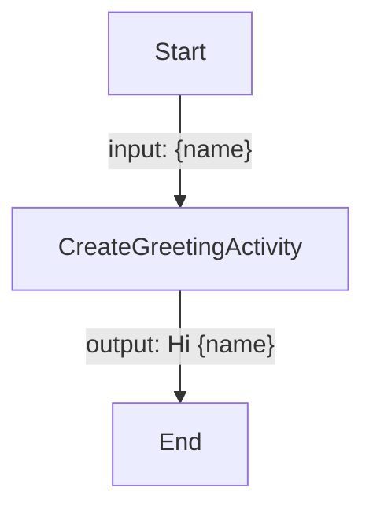
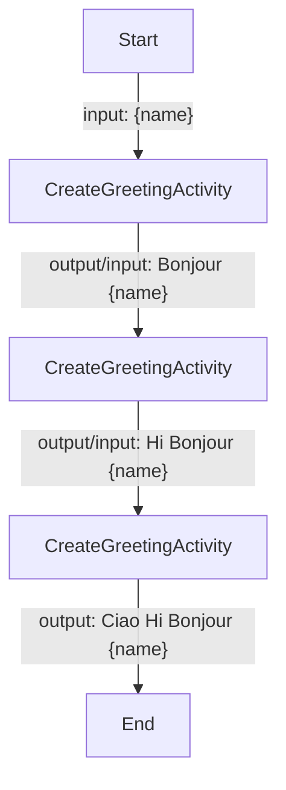
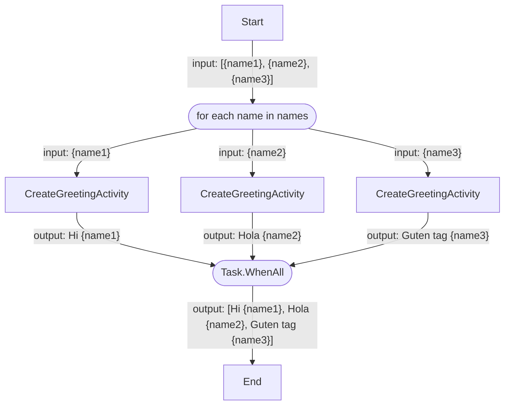
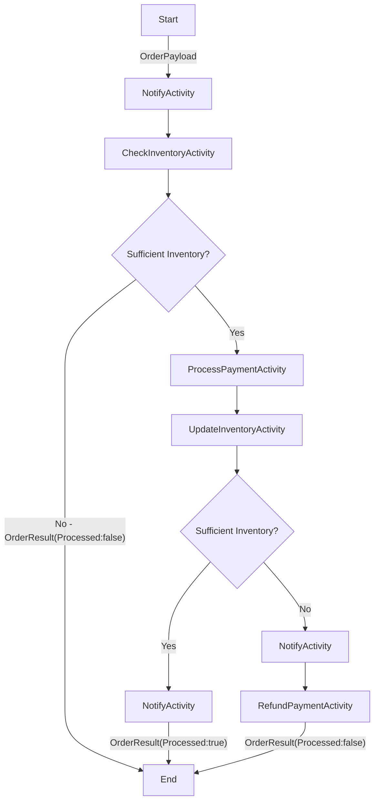
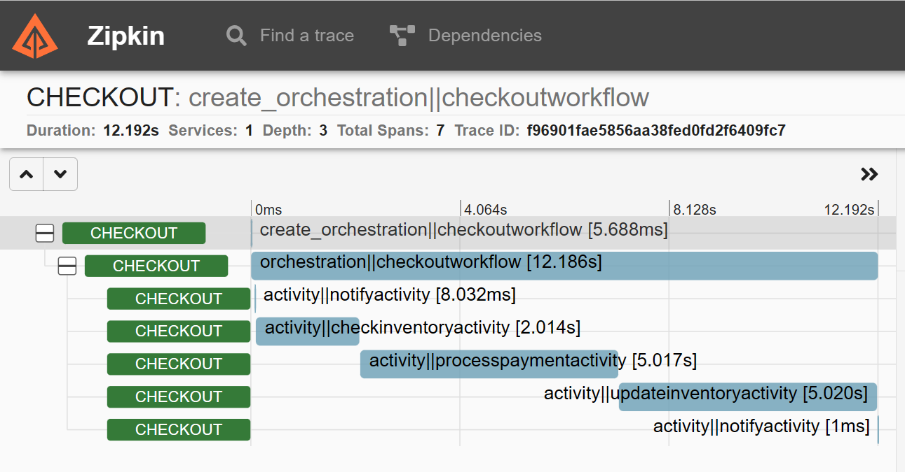

# Dapr workflow demos

Demos applications that use the Dapr Workflow building block.

## Prerequisites

1. [.NET 7 SDK](https://dotnet.microsoft.com/download/dotnet/7.0)
2. [Dapr CLI](https://docs.dapr.io/getting-started/install-dapr-cli/)
3. A REST client, such as [cURL](https://curl.se/), or the VSCode [REST client extension](https://marketplace.visualstudio.com/items?itemName=humao.rest-client).

    > The VSCode REST client is configured as a recommended extension when opening this repo in VSCode.

## Hello world workflow sample

The Hello World Workflow sample is a very basic workflow with just one activity that returns a random greeting. The workflow takes a name as input and returns a greeting with the name as output.



### Run the HelloWorldWorkflowSample app

1. Change to the BasicWorkflowSamples directory and build the ASP.NET app:

    ```bash
    cd BasicWorkflowSamples
    dotnet build
    ```

2. Run the app using the Dapr CLI:

    ```bash
    dapr run --app-id basic-workflows --app-port 5065 --dapr-http-port 3500 dotnet run
    ```

    > Ensure the --app-port is the same as the port specified in the launchSettings.json file.

3. Start the `HelloWorldWorkflow` via the Workflow HTTP API using cURL, or use the [basicworkflows.http](BasicWorkflowSamples/basicworkflows.http) file if you're using VSCode with the REST client:

   ```bash
   curl -i -X POST http://localhost:3500/v1.0-alpha1/workflows/dapr/HelloWorldWorkflow/1234a/start \
     -H "Content-Type: application/json" \
     -d '{ "input" : "Marc"}'
    ```

    > Note that `1234a` in the URL is the workflow instance ID. This can be any string you want.

    Expected result:

    ```json
    {
        "instance_id": "<WORKFLOW_ID>"
    }
    ```

4. Check the workflow status via Workflow HTTP API:

    ```bash
    curl -i -X GET http://localhost:3500/v1.0-alpha1/workflows/dapr/HelloWorldWorkflow/1234a/status
    ```

    Expected result:

    ```json
    {
        "WFInfo": {
            "instance_id": "<WORKFLOW_ID>"
        },
        "start_time": "2023-05-01T12:15:45Z",
        "metadata": {
            "dapr.workflow.custom_status": "",
            "dapr.workflow.input": "\"Marc"\",
            "dapr.workflow.last_updated": "2023-05-01T12:15:45Z",
            "dapr.workflow.name": "HelloWorldWorkflow",
            "dapr.workflow.output": "\"Hi Marc"\",
            "dapr.workflow.runtime_status": "COMPLETED"
        }
    }
    ```

## Chaining workflow sample

The Chaining Workflow sample is a workflow that chains three activities of the same type `CreateGreetingActivity`, each prepending a random greeting to the input. The output of the activity is used as an input for the next activity in the chain.



1. Ensure that the BasicWorkflowSamples app is still running, if not change to the BasicWorkflowSamples directory, build the app, and run the app using the Dapr CLI:

    ```bash
    cd BasicWorkflowSamples
    dotnet build
    dapr run --app-id basic-workflows --app-port 5065 --dapr-http-port 3500 dotnet run
    ```

2. Start the `ChainingWorkflow` via the Workflow HTTP API using cURL, or use the [basicworkflows.http](BasicWorkflowSamples/basicworkflows.http) file if you're using VSCode with the REST client:

   ```bash
   curl -i -X POST http://localhost:3500/v1.0-alpha1/workflows/dapr/ChainingWorkflow/1234b/start \
     -H "Content-Type: application/json" \
     -d '{ "input" : "Marc"}'
    ```

    > Note that `1234b` in the URL is the workflow instance ID. This can be any string you want.

    Expected result:

    ```json
    {
        "instance_id": "<WORKFLOW_ID>"
    }
    ```

3. Check the workflow status via Workflow HTTP API:

    ```bash
    curl -i -X GET http://localhost:3500/v1.0-alpha1/workflows/dapr/ChainingWorkflow/1234b/status
    ```

    Expected result:

    ```json
    {
        "WFInfo": {
            "instance_id": "<WORKFLOW_ID>"
        },
        "start_time": "2023-05-10T12:07:38Z",
        "metadata": {
            "dapr.workflow.custom_status": "",
            "dapr.workflow.input": "\"Marc\"",
            "dapr.workflow.last_updated": "2023-05-10T12:07:38Z",
            "dapr.workflow.name": "ChainingWorkflow",
            "dapr.workflow.output": "\"Ciao Hi Bonjour Marc\"",
            "dapr.workflow.runtime_status": "COMPLETED"
        }
    }
    ```

## Fan-out / Fan-in workflow sample

The Fan-out / Fan-in Workflow sample is a workflow that fans out and schedules an activity (`CreateGreetingActivity`) for each element in the input array and waits until all of the activities are completed. The output of the workflow is an array of greetings.



1. Ensure that the BasicWorkflowSamples app is still running, if not change to the BasicWorkflowSamples directory, build the app, and run the app using the Dapr CLI:

    ```bash
    cd BasicWorkflowSamples
    dotnet build
    dapr run --app-id basic-workflows --app-port 5065 --dapr-http-port 3500 dotnet run
    ```

2. Start the `FanOutFanInWorkflow` via the Workflow HTTP API using cURL, or use the [basicworkflows.http](BasicWorkflowSamples/basicworkflows.http) file if you're using VSCode with the REST client:

   ```bash
   curl -i -X POST http://localhost:3500/v1.0-alpha1/workflows/dapr/FanOutFanInWorkflow/1234c/start \
     -H "Content-Type: application/json" \
     -d '{ "input" : ["Alice", "Kendall", "Sam"]"}'
    ```

    > Note that `1234c` in the URL is the workflow instance ID. This can be any string you want.

    Expected result:

    ```json
    {
        "instance_id": "<WORKFLOW_ID>"
    }
    ```

3. Check the workflow status via Workflow HTTP API:

    ```bash
    curl -i -X GET http://localhost:3500/v1.0-alpha1/workflows/dapr/FanOutFanInWorkflow/1234c/status
    ```

    Expected result:

    ```json
    {
        "WFInfo": {
            "instance_id": "<WORKFLOW_ID>"
        },
        "start_time": "2023-05-14T16:29:53Z",
        "metadata": {
            "dapr.workflow.custom_status": "",
            "dapr.workflow.input": "[\"Alice\",\"Kendall\",\"Sam\"]",
            "dapr.workflow.last_updated": "2023-05-14T16:29:54Z",
            "dapr.workflow.name": "FanOutFanInWorkflow",
            "dapr.workflow.output": "[\"Guten Tag Alice\",\"Hi Kendall\",\"Hello Sam\"]",
            "dapr.workflow.runtime_status": "COMPLETED"
        }
    ```

## CheckoutWorkflow sample

The Checkout Workflow sample is a workflow that processes an order. The workflow takes an order payload as input and returns an order result as output. The workflow uses these activities:

- `NotifyActivity`: Notifies the customer of the progress of the order.
- `CheckInventoryActivity`: Checks if the inventory is sufficient.
- `ProcessPaymentActivity`: Processes the payment.
- `UpdateInventoryActivity`: Updates the inventory after checking it again.
- `RefundPaymentActivity`: Refunds the payment if the `UpdateInventoryActivity` throws an exception.



The `CheckInventoryActivity` and `UpdateInventoryActivity` classes use [Dapr's state management building block](https://docs.dapr.io/developing-applications/building-blocks/state-management/) to manage the inventory in a Redis state store.

Next to the workflow, this application has an `InventoryController` with the following endpoints:

- `GET http://localhost:5064/inventory`: retrieves the inventory
- `DELETE http://localhost:5064/inventory`: clears the inventory
- `POST http://localhost:5064/inventory/restock`: restocks the inventory

The `InventoryController` also uses Dapr's state management building block.

### Run the CheckoutWorkflowSample app

1. Change to the CheckoutService directory and build the ASP.NET app:

    ```bash
    cd CheckoutService
    dotnet build
    ```

2. Run the app using the Dapr CLI:

    ```bash
    dapr run --app-id checkout --app-port 5064 --dapr-http-port 3500 --resources-path ./Resources dotnet run
    ```

    > Ensure the --app-port is the same as the port specified in the launchSettings.json file.

3. Check the inventory using cURL, or use the [checkout.http](CheckoutService/checkout.http) file if you're using VSCode with the REST client:

    ```bash
    curl -X POST http://localhost:5064/inventory/restock
    ```

    If the quantity of the items is not 0, clear the inventory by running:

    ```bash
    curl -X POST http://localhost:5064/inventory/clear
    ```

4. Try ordering 100 paperclips while the inventory is not sufficient. Start the `CheckoutWorkflow` via the Workflow HTTP API:

   ```bash
   curl -i -X POST http://localhost:3500/v1.0-alpha1/workflows/dapr/CheckoutWorkflow/1234d/start \
     -H "Content-Type: application/json" \
     -d '{ "input" : {"Name": "Paperclips", "Quantity": 100}}'
    ```

    > Note that `1234d` in the URL is the workflow instance ID. This can be any string you want.

    Expected result:

    ```json
    {
        "instance_id": "<WORKFLOW_ID>"
    }
    ```

    > Pay attention to the console output. A message will appear that indicates the inventory is insufficient.

5. Check the workflow status via Workflow HTTP API:

    ```bash
    curl -i -X GET http://localhost:3500/v1.0-alpha1/workflows/dapr/CheckoutWorkflow/1234d/status
    ```

    Expected result:

    ```json
    {
        "WFInfo": {
            "instance_id": "<WORKFLOW_ID>"
        },
        "start_time": "2023-05-01T12:15:45Z",
        "metadata": {
            "dapr.workflow.custom_status": "\"Stopped order process due to insufficient inventory.\"",
            "dapr.workflow.input": "{\"Name\":\"Paperclips\",\"Quantity\":100}",
            "dapr.workflow.last_updated": "2023-05-01T12:15:45Z",
            "dapr.workflow.name": "CheckoutWorkflow",
            "dapr.workflow.output": "{\"Processed\":false}",
            "dapr.workflow.runtime_status": "COMPLETED"
        }
    }
    ```

    > Depending on how quick the status is retrieved after starting the workflow, the `dapr.workflow.runtime_status` could still be `"RUNNING"`. Repeat the GET status request until the status is `"COMPLETED"`.

6. Restock the inventory:

    ```bash
    curl -X POST http://localhost:5064/inventory/restock
    ```

    Expected result: `HTTP 200 OK`

7. Try ordering paperclips again, now within the limits of the inventory. Start the `CheckoutWorkflow` via the Workflow HTTP API:

    ```bash
    curl -i -X POST http://localhost:3500/v1.0-alpha1/workflows/dapr/CheckoutWorkflow/1234d/start \
     -H "Content-Type: application/json" \
     -d '{ "input" : {"Name": "Paperclips", "Quantity": 100}}'
    ```

    > Note that `1234d` in the URL is the workflow instance ID. This can be any string you want.

    Expected result:

    ```json
    {
        "instance_id": "<WORKFLOW_ID>"
    }
    ```

    > Pay attention to the console output. Messages will appear that indicate the inventory is sufficient and payment has been processed successfully.

8. Check the workflow status via Workflow HTTP API:

    ```bash
    curl -i -X GET http://localhost:3500/v1.0-alpha1/workflows/dapr/CheckoutWorkflow/1234d/status
    ```

    Expected result:

    ```json
    {
        "WFInfo": {
            "instance_id": "<WORKFLOW_ID>"
        },
        "start_time": "2023-05-01T12:22:25Z",
        "metadata": {
            "dapr.workflow.custom_status": "",
            "dapr.workflow.input": "{\"Name\":\"Paperclips\",\"Quantity\":100}",
            "dapr.workflow.last_updated": "2023-05-01T12:22:37Z",
            "dapr.workflow.name": "CheckoutWorkflow",
            "dapr.workflow.output": "{\"Processed\":true}",
            "dapr.workflow.runtime_status": "COMPLETED"
        }
    }
    ```

9. Inspect the logs in ZipKin: [`localhost:9411/zipkin`](http://localhost:9411/zipkin). Find the entry marked `checkout:create_orchestration||checkoutworkflow` and show the details. You'll now see a timeline of the workflow at the top, and the activities underneath.

    

## Resources

1. [Dapr Workflow overview](https://docs.dapr.io/developing-applications/building-blocks/workflow/workflow-overview/).
2. [How to: Author and manage Dapr Workflow in the .NET SDK](https://docs.dapr.io/developing-applications/sdks/dotnet/dotnet-workflow/dotnet-workflow-howto/)

## More information

Any questions or comments about this sample? Join the [Dapr discord](https://bit.ly/dapr-discord) and post a message the `#workflow` channel.
Have you made something with Dapr? Post a message in the `#show-and-tell` channel, we love to see your creations!
